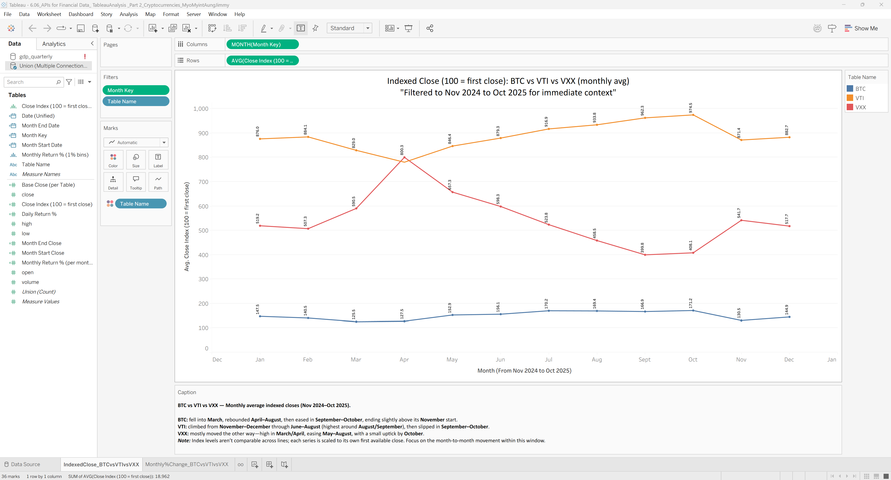

# finance-apis-analysis

<!-- Badges/Tags Placeholders -->


<!-- Hero Image Suggestion: Add your Tableau overview dashboard here -->
<!--  -->

## TL;DR

**Quick Summary:** API-driven financial data analysis using Alpha Vantage to fetch macro & market data, process it through Jupyter notebooks, and visualize insights with Tableau. This project demonstrates end-to-end data pipeline development—from API acquisition to cleaned time series and visual analytics.

**Key Features:**
- 📊 Automated data acquisition from Alpha Vantage API
- 🧹 Data cleaning and transformation pipelines
- 📈 Time series analysis (indexed close, daily/monthly returns)
- 📉 Tableau dashboards and visualizations
- 🔒 Security-first: No API keys or sensitive data committed

---

## Repository Structure

```
finance-apis-analysis/
├── data/                       # Data directory (excluded from git)
│   ├── raw/                   # Raw API responses
│   ├── processed/             # Cleaned and transformed data
│   └── README.md              # Data acquisition and reproduction guide
├── notebooks/                  # Jupyter notebooks
│   ├── 01_data_acquisition.ipynb
│   ├── 02_data_cleaning.ipynb
│   └── 03_analysis.ipynb
├── reports/                    # Tableau visualizations and screenshots
│   └── Tableau_overview.png   # Hero dashboard image
├── src/                        # Source code (if applicable)
├── .gitignore                 # Git ignore patterns
├── LICENSE                     # MIT License
└── README.md                   # This file
```

---

## Quick Start

### Prerequisites

- Python 3.8 or higher
- Jupyter Notebook/Lab
- Alpha Vantage API key (free at [alphavantage.co](https://www.alphavantage.co/support/#api-key))
- Tableau Desktop (for viewing/editing dashboards)

### Installation

1. **Clone the repository:**
   ```bash
   git clone https://github.com/JimmyAung/finance-apis-analysis.git
   cd finance-apis-analysis
   ```

2. **Set up Python environment:**
   ```bash
   # Create virtual environment
   python -m venv venv
   source venv/bin/activate  # On Windows: venv\Scripts\activate
   
   # Install dependencies
   pip install -r requirements.txt  # If requirements.txt exists
   ```

3. **Configure API credentials:**
   ```bash
   # Create a .env file (never commit this!)
   echo "ALPHA_VANTAGE_API_KEY=your_api_key_here" > .env
   ```

4. **Launch Jupyter:**
   ```bash
   jupyter notebook
   ```

5. **Run the notebooks** in sequence (01 → 02 → 03) to reproduce the analysis.

---

## Reproducibility

This project prioritizes reproducibility and transparency. All data can be regenerated from publicly available sources using the provided notebooks.

**📖 For detailed instructions on reproducing the analysis:**

See **[`/data/README.md`](/data/README.md)** for:
- Data source specifications
- API endpoints used
- Data schema and format descriptions
- Step-by-step reproduction guide
- Expected output descriptions

**Note:** API keys and raw data are **excluded from version control** for security and storage reasons. Follow the data README to fetch your own data using the Alpha Vantage free tier API.

---

## Features & Analysis

- **Data Acquisition:** Automated API calls to Alpha Vantage for stock prices, market indices, and economic indicators
- **Data Cleaning:** Handling missing values, outliers, and data type conversions
- **Time Series Processing:** 
  - Indexed close prices (normalized to 100)
  - Daily and monthly returns calculation
  - Rolling statistics and moving averages
- **Visualization:** 
  - Tableau dashboards for interactive exploration
  - Python plots for exploratory data analysis
  - Export-ready charts and screenshots

---

## Project Workflow

1. **Acquisition** → Fetch data via Alpha Vantage API
2. **Cleaning** → Process raw JSON/CSV into tidy DataFrames
3. **Analysis** → Calculate returns, indices, and statistics
4. **Visualization** → Create Tableau dashboards and Python plots
5. **Documentation** → Export findings and visualizations

---

## Security & Best Practices

⚠️ **Important Security Notes:**
- **Never commit API keys** to version control
- Use environment variables or `.env` files for credentials
- The `.gitignore` is configured to exclude sensitive files
- Review changes before committing to ensure no secrets are included

---

## License

This project is licensed under the MIT License - see the [LICENSE](LICENSE) file for details.

---

## Contributing

Contributions are welcome! Please feel free to submit issues or pull requests.

---

## Contact & Attribution

**Author:** Jimmy Aung  
**Repository:** [github.com/JimmyAung/finance-apis-analysis](https://github.com/JimmyAung/finance-apis-analysis)

**Data Source:** [Alpha Vantage](https://www.alphavantage.co/) - Free APIs for realtime and historical financial data.
